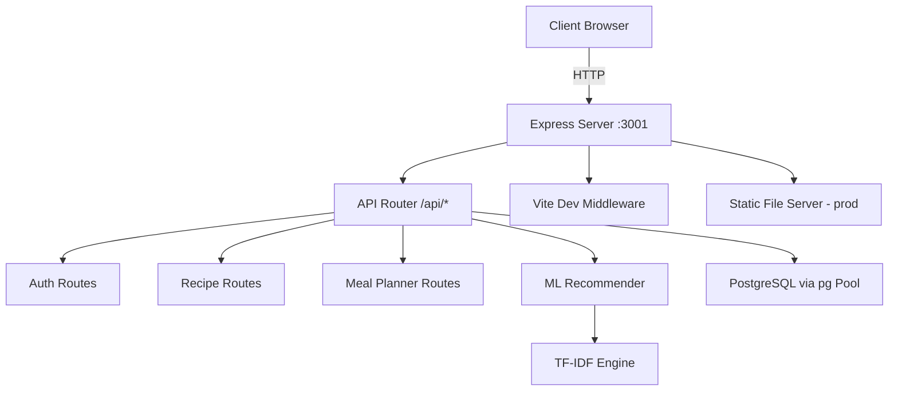
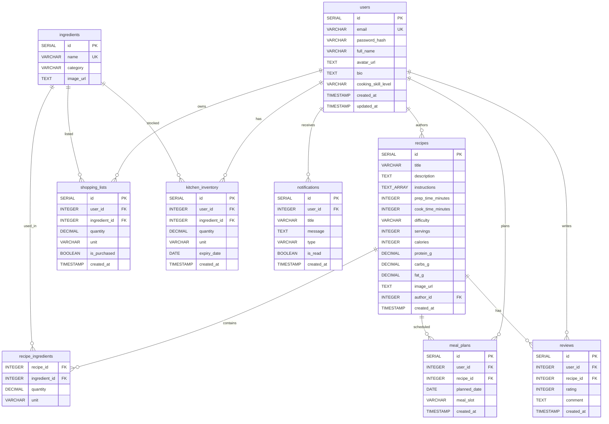
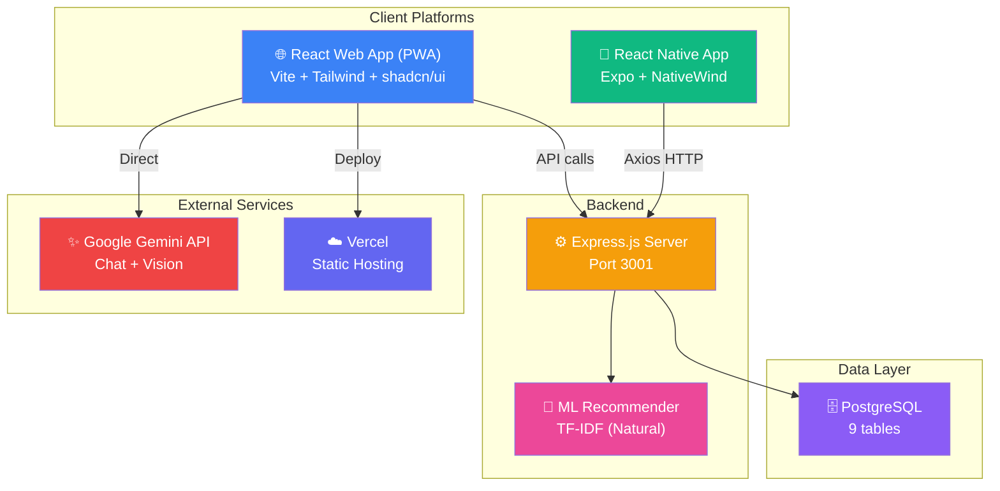

# 🍳 CookMate — Full System Structure

> **CookMate** is an AI-powered recipe and meal planning assistant built as a multi-platform system: a **React web app (PWA)**, a **React Native mobile app**, and an **Express.js backend** — all backed by a **PostgreSQL database** and **Gemini AI**.

---

## 📁 Project Root — `cookmate/`

```
cookmate/
├── .env                    # Environment variables (Gemini API key, DB credentials)
├── .env.example            # Template for .env
├── .gitignore              # Git ignore rules
├── README.md               # Project overview & setup instructions
├── metadata.json           # App metadata (name, description, permissions)
├── index.html              # SPA entry point (Vite injects scripts here)
├── package.json            # Root dependencies & scripts
├── package-lock.json       # Lockfile
├── tsconfig.json           # TypeScript configuration
├── vite.config.ts          # Vite build config (PWA, TailwindCSS, path aliases)
├── vercel.json             # Vercel deployment config (SPA rewrites)
├── components.json         # shadcn/ui component generator config
│
├── public/                 # Static assets (served as-is)
├── src/                    # 🌐 Web application source
├── components/             # 🧩 shadcn/ui components (root-level)
├── database/               # 🗄️ Database schema
├── mobile/                 # 📱 React Native mobile app
├── dist/                   # Production build output
└── node_modules/           # Dependencies
```

---

## 🛠️ Technology Stack

| Layer | Technology | Purpose |
|---|---|---|
| **Frontend (Web)** | React 19 + TypeScript | SPA with client-side routing |
| **Styling** | Tailwind CSS 4 + shadcn/ui | Utility-first CSS + pre-built UI components |
| **Animations** | Motion (Framer Motion) | Page transitions & micro-animations |
| **Routing** | React Router DOM v7 | Client-side page navigation |
| **AI** | Google Gemini (`@google/genai`) | AI chat assistant, recipe generation |
| **PWA** | vite-plugin-pwa + Workbox | Offline support, installability |
| **Backend** | Express.js + tsx | REST API server (TypeScript, hot-reload) |
| **Database** | PostgreSQL + `pg` | Persistent data storage |
| **Auth** | bcryptjs + jsonwebtoken | Password hashing + JWT tokens |
| **ML** | Natural (TF-IDF) | Recipe recommendation engine |
| **Mobile** | React Native + Expo (SDK 54) | Android/iOS native app |
| **Mobile Navigation** | React Navigation v6 | Stack + Tab navigation |
| **Build** | Vite 6 | Dev server + production bundler |
| **Deployment** | Vercel | Static hosting with SPA rewrites |

---

## 🌐 Web Application — `src/`

```
src/
├── main.tsx                    # React DOM entry point (renders <App />)
├── App.tsx                     # Root component — defines all routes
├── index.css                   # Global styles & Tailwind base
│
├── pages/                      # 📄 Page-level components (one per route)
│   ├── Dashboard.tsx           # Home page — featured recipes, seasonal ingredients
│   ├── Search.tsx              # Recipe search with filters
│   ├── RecipeDetail.tsx        # Full recipe view (instructions, nutrition, reviews)
│   ├── MealPlanner.tsx         # Weekly meal planning calendar
│   ├── AICamera.tsx            # AI-powered ingredient scanner (camera)
│   ├── Profile.tsx             # User profile & cooking stats
│   ├── Notifications.tsx       # Notification center
│   └── Settings.tsx            # App settings & preferences
│
├── components/                 # 🧩 Reusable UI components
│   ├── Sidebar.tsx             # Main navigation sidebar
│   ├── TopBar.tsx              # Top navigation bar (search, user menu)
│   ├── RightPanel.tsx          # Right sidebar (AI chat, quick actions)
│   ├── AIChatWidget.tsx        # Gemini AI chat assistant widget
│   ├── FeaturedRecipes.tsx     # Carousel of featured recipes
│   ├── RecentRecipes.tsx       # Recently viewed recipes list
│   ├── SeasonalIngredients.tsx # Seasonal ingredient suggestions
│   ├── CookingSkillContent.tsx # Cooking skill level display
│   └── ui/                     # shadcn/ui primitives (src-level copies)
│       ├── badge.tsx
│       ├── button.tsx
│       ├── card.tsx
│       ├── input.tsx
│       ├── scroll-area.tsx
│       ├── sonner.tsx          # Toast notification provider
│       └── tabs.tsx
│
├── lib/                        # 🔧 Utilities
│   └── utils.ts                # Tailwind class merge utility (cn())
│
├── backend/                    # ⚙️ Express.js backend server
│   ├── server.ts               # Main server — API routes, Vite middleware
│   └── db.ts                   # PostgreSQL connection pool (pg)
│
└── ml/                         # 🤖 Machine Learning module
    └── recommender.ts          # TF-IDF recipe recommender (Natural library)
```

### Client-Side Routes

| Path | Component | Description |
|---|---|---|
| `/` | `Dashboard` | Home page with featured & recent recipes |
| `/search` | `Search` | Recipe search with filters |
| `/recipe/:id` | `RecipeDetail` | Individual recipe view |
| `/planner` | `MealPlanner` | Weekly meal planning |
| `/camera` | `AICamera` | AI ingredient scanner |
| `/profile` | `Profile` | User profile page |
| `/notifications` | `Notifications` | Notification center |
| `/settings` | `Settings` | App preferences |

---

## ⚙️ Backend Server — `src/backend/`

### API Endpoints

| Method | Endpoint | Status | Description |
|---|---|---|---|
| `GET` | `/api/health` | ✅ Active | Health check |
| `*` | `/api/auth` | 🟡 Skeleton | Authentication (login, register, JWT) |
| `*` | `/api/recipes` | 🟡 Skeleton | CRUD recipes |
| `*` | `/api/ingredients` | 🟡 Skeleton | Ingredient management |
| `*` | `/api/meal-planner` | 🟡 Skeleton | Meal plan CRUD |
| `*` | `/api/shopping-list` | 🟡 Skeleton | Shopping list management |
| `*` | `/api/notifications` | 🟡 Skeleton | Notification management |
| `*` | `/api/profile` | 🟡 Skeleton | User profile management |
| `POST` | `/api/ml/recommend/by-ingredients` | ✅ Active | ML-based recipe recommendations |
| `*` | `/api/ml/camera` | 🟡 Skeleton | ML camera endpoint |

### Server Architecture



---

## 🗄️ Database — `database/`

### Schema: `schema.sql` (PostgreSQL)



---

## 🧩 UI Component Library — `components/`

Root-level shadcn/ui components (generated via `shadcn` CLI):

```
components/
└── ui/
    ├── avatar.tsx          # User avatar with fallback
    ├── badge.tsx           # Status/tag badges
    ├── button.tsx          # Button variants (default, outline, ghost, etc.)
    ├── card.tsx            # Card container (header, content, footer)
    ├── dialog.tsx          # Modal dialog
    ├── dropdown-menu.tsx   # Dropdown menu with items
    ├── input.tsx           # Text input field
    ├── scroll-area.tsx     # Custom scrollbar container
    ├── sheet.tsx           # Slide-out sheet/drawer
    ├── sonner.tsx          # Toast notifications (Sonner)
    └── tabs.tsx            # Tabbed interface
```

> **Note:** There are two `ui/` directories — `components/ui/` (root, shadcn canonical path) and `src/components/ui/` (source-level copies). The `@/components/ui` alias resolves to `src/components/ui/`.

---

## 📱 Mobile App — `mobile/`

A full **React Native + Expo** app that mirrors the web experience natively.

```
mobile/
├── App.js                      # Root component (navigation providers)
├── app.json                    # Expo configuration (package: com.cookmate.app)
├── babel.config.js             # Babel config (expo preset)
├── eas.json                    # EAS Build profiles (dev, preview, production)
├── tailwind.config.js          # NativeWind Tailwind config
├── package.json                # Mobile dependencies
├── PLAY_STORE_CHECKLIST.md     # Google Play Store submission checklist
│
└── src/
    ├── api/
    │   └── api.js              # Axios HTTP client (connects to Express backend)
    │
    ├── components/
    │   ├── AIAssistantWidget.js # Floating AI assistant button
    │   ├── IngredientTag.js     # Ingredient pill/tag
    │   ├── MealSlot.js          # Meal plan time slot card
    │   ├── NotificationCard.js  # Notification list item
    │   └── RecipeCard.js        # Recipe card thumbnail
    │
    ├── context/
    │   └── AuthContext.js       # Authentication state provider (SecureStore)
    │
    ├── navigation/
    │   ├── AppNavigator.js      # Root stack navigator
    │   └── BottomTabNavigator.js # Bottom tab bar (Home, Search, Camera, Profile)
    │
    └── screens/
        ├── HomeScreen.js           # Home feed
        ├── SearchScreen.js         # Recipe search
        ├── RecipeDetailScreen.js   # Full recipe view
        ├── MealPlannerScreen.js    # Meal planning
        ├── CameraScreen.js         # Camera ingredient scanner
        ├── CookingModeScreen.js    # Step-by-step cooking mode
        ├── ProfileScreen.js        # User profile
        └── NotificationsScreen.js  # Notifications
```

### Mobile Permissions (Android)

| Permission | Purpose |
|---|---|
| `CAMERA` | AI ingredient scanner |
| `NOTIFICATIONS` | Push notifications for meal reminders |
| `INTERNET` | API communication |

---

## 🤖 ML / AI Features

### 1. Recipe Recommender (`src/ml/recommender.ts`)
- **Algorithm:** TF-IDF (Term Frequency–Inverse Document Frequency) via the `natural` NLP library
- **How it works:** Recipes are vectorized by their ingredient lists. User input ingredients are compared against all recipes using cosine similarity
- **Endpoint:** `POST /api/ml/recommend/by-ingredients`

### 2. Gemini AI Chat (`src/components/AIChatWidget.tsx`)
- **Provider:** Google Gemini via `@google/genai`
- **Features:** Conversational cooking assistant, recipe suggestions, cooking tips
- **API Key:** Injected via `process.env.GEMINI_API_KEY` (defined in `.env`)

### 3. AI Camera (`src/pages/AICamera.tsx`)
- **Feature:** Point camera at ingredients → AI identifies them → suggests recipes
- **Uses:** Device camera API + Gemini vision capabilities

---

## 📦 NPM Scripts

### Web (`package.json`)

| Script | Command | Purpose |
|---|---|---|
| `dev` | `tsx src/backend/server.ts` | Start Express + Vite dev server |
| `build` | `vite build` | Production build to `dist/` |
| `preview` | `vite preview` | Preview production build locally |
| `clean` | removes `dist/` | Clean build artifacts |
| `lint` | `tsc --noEmit` | Type-check without emitting |

### Mobile (`mobile/package.json`)

| Script | Command | Purpose |
|---|---|---|
| `start` | `expo start` | Start Expo dev server |
| `android` | `expo start --android` | Run on Android device/emulator |
| `ios` | `expo start --ios` | Run on iOS simulator |
| `web` | `expo start --web` | Run as web app (Expo web) |

---

## 🔧 Configuration Files

| File | Purpose |
|---|---|
| `vite.config.ts` | Vite build: React plugin, Tailwind, PWA manifest, code splitting, path aliases |
| `tsconfig.json` | TypeScript: ES2022 target, JSX react-jsx, `@/*` path alias |
| `components.json` | shadcn/ui: base-nova style, Lucide icons, component aliases |
| `vercel.json` | Vercel: SPA catch-all rewrite to `index.html` |
| `.env` | Secrets: `GEMINI_API_KEY`, `DB_HOST`, `DB_PORT`, `DB_USER`, `DB_PASSWORD`, `DB_NAME` |
| `mobile/eas.json` | EAS Build: dev/preview/production build profiles |
| `mobile/app.json` | Expo: app name, package ID, permissions, splash screen |

---

## 🏗️ Architecture Overview



---

## 📊 Current Project Status

| Area | Status | Notes |
|---|---|---|
| Web UI (Pages) | ✅ Built | 8 pages with full routing |
| Web Components | ✅ Built | Sidebar, TopBar, AI Chat, etc. |
| shadcn/ui | ✅ Configured | 11 components installed |
| PWA Support | ✅ Configured | Service worker, manifest, icons |
| Express Server | 🟡 Partial | Health + ML endpoints active; other routes are skeletons |
| Database Schema | ✅ Designed | 9 PostgreSQL tables defined |
| DB Connection | ✅ Configured | pg Pool with env-based credentials |
| ML Recommender | ✅ Working | TF-IDF on mock recipe data |
| Gemini AI | ✅ Integrated | Chat widget + camera vision |
| Mobile App | ✅ Scaffolded | 8 screens, navigation, API client |
| Authentication | 🔴 Not Implemented | JWT + bcrypt dependencies installed, no logic |
| API CRUD Routes | 🔴 Not Implemented | All endpoints return placeholder JSON |
| Deployment | ✅ Configured | Vercel with SPA rewrites |
